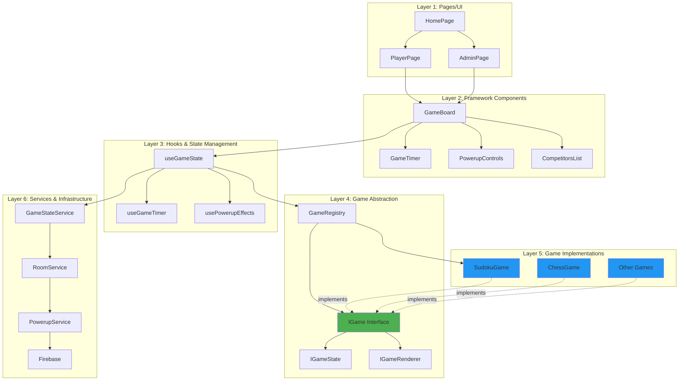
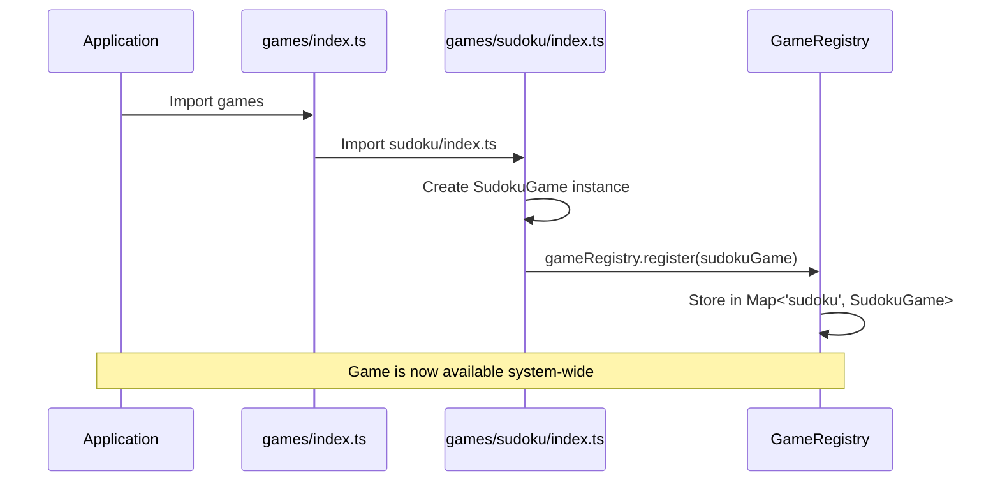
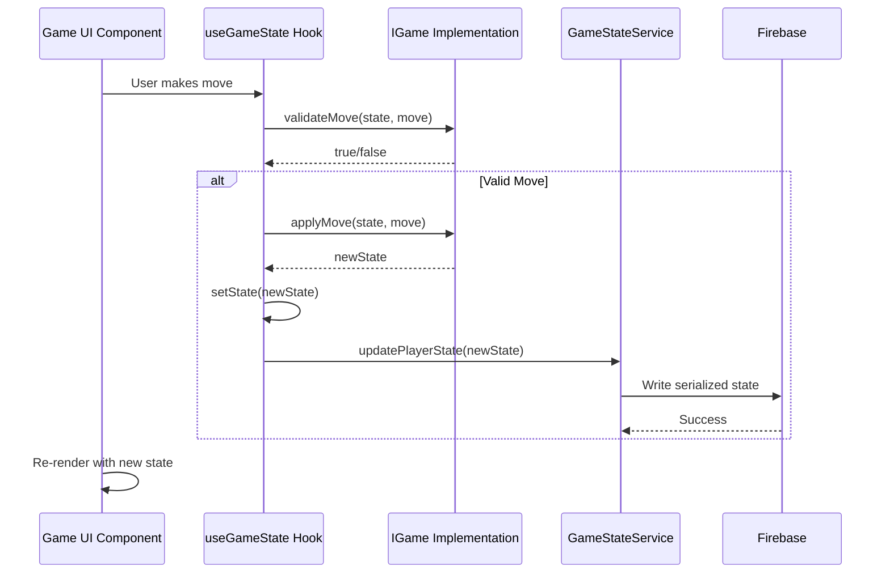
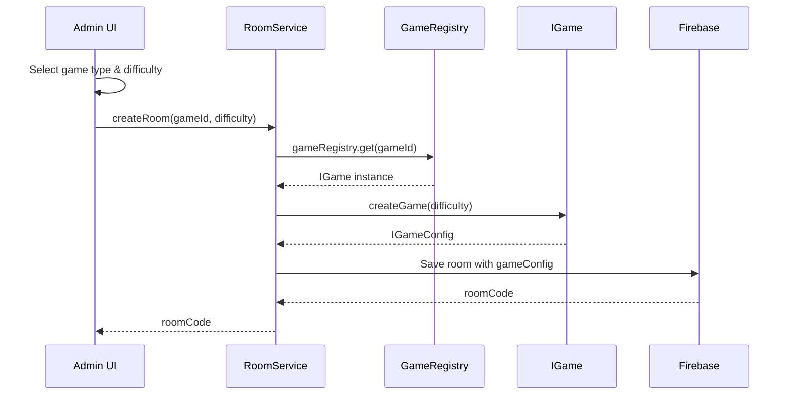

# 🏗️ Office Games - Architecture Documentation

## Table of Contents

- [Overview](#overview)
- [Architecture Layers](#architecture-layers)
- [Core Concepts](#core-concepts)
- [Game Plugin System](#game-plugin-system)
- [Adding a New Game](#adding-a-new-game)
- [Framework Components](#framework-components)
- [Data Flow](#data-flow)
- [Best Practices](#best-practices)

---

## Overview

Office Games is a **multi-game platform** designed to support real-time multiplayer office games. The architecture uses a **plugin-based system** where different games (Sudoku, Chess, Tic-Tac-Toe, etc.) can be added without modifying core framework code.

### Design Principles

1. **Separation of Concerns** - Clear boundaries between framework, abstraction, and game implementation
2. **Interface-Based Design** - Games implement standard interfaces (`IGame`, `IGameState`, `IGameRenderer`)
3. **Loose Coupling** - Components depend on abstractions, not concrete implementations
4. **Single Responsibility** - Each module has one clear purpose
5. **Open/Closed Principle** - Open for extension (new games), closed for modification

---

## Architecture Layers



### Layer Descriptions

| Layer | Purpose | Examples |
|-------|---------|----------|
| **1. Pages/UI** | Route-level components, layout | `PlayerPage`, `AdminPage`, `HomePage` |
| **2. Framework Components** | Reusable, game-agnostic UI | `GameBoard`, `GameTimer`, `PowerupControls` |
| **3. Hooks** | State management, side effects | `useGameState`, `useGameTimer`, `usePowerupEffects` |
| **4. Game Abstraction** | Interfaces and registry | `IGame`, `IGameState`, `GameRegistry` |
| **5. Game Implementations** | Specific game logic | `SudokuGame`, `ChessGame`, etc. |
| **6. Services** | External integrations, data persistence | `GameStateService`, `RoomService`, Firebase |

---

## Core Concepts

### 1. Game Registry

The **Game Registry** is a central catalog of all available games in the system.

```typescript
// games/core/GameRegistry.ts
class GameRegistry {
  private games: Map<string, IGame> = new Map();
  
  register(game: IGame): void {
    this.games.set(game.id, game);
  }
  
  get(gameId: string): IGame | undefined {
    return this.games.get(gameId);
  }
  
  getAll(): IGame[] {
    return Array.from(this.games.values());
  }
}

export const gameRegistry = new GameRegistry();
```

**Usage:**
- Games self-register when imported
- Pages/components retrieve game instances by ID
- No hard-coded game references in framework code

### 2. Game Interface (`IGame`)

All games must implement this interface:

```typescript
export interface IGame {
  // Metadata
  readonly id: string;              // e.g., 'sudoku', 'chess'
  readonly name: string;            // e.g., 'Sudoku Sprint'
  readonly minPlayers: number;
  readonly maxPlayers: number;
  readonly supportsPowerups: boolean;
  readonly difficultyLevels: string[];
  
  // Game lifecycle
  createGame(difficulty: string): IGameConfig;
  validateMove(state: IGameState, move: IGameMove): boolean;
  applyMove(state: IGameState, move: IGameMove): IGameState;
  calculateScore(state: IGameState, initialState: IGameState): number;
  isGameComplete(state: IGameState): boolean;
  isGameCorrect(state: IGameState, solution: IGameState): boolean;
  
  // Rendering
  getRenderer(): IGameRenderer;
}
```

### 3. Game State (`IGameState`)

Represents the current state of a game (e.g., Sudoku grid, Chess position):

```typescript
export interface IGameState {
  serialize(): string;                      // For Firebase storage
  deserialize(data: string): IGameState;    // From Firebase data
  clone(): IGameState;                      // Create deep copy
}
```

**Why serialize/deserialize?**
- Firebase stores data as strings
- Enables game-agnostic database operations
- Each game controls its own serialization format

### 4. Game Renderer (`IGameRenderer`)

Handles game-specific rendering:

```typescript
export interface IGameRenderer {
  renderPlayerBoard(props: PlayerBoardProps): React.ReactElement;
  renderMiniBoard(props: MiniBoardProps): React.ReactElement;
  renderControls(props: ControlsProps): React.ReactElement;
}
```

**Separation of Concerns:**
- Framework components handle layout, timers, powerups
- Game renderers handle game-specific visuals (grid, pieces, etc.)

---

## Game Plugin System

### File Structure

```
src/games/
├── core/                           # Shared abstractions
│   ├── interfaces/
│   │   ├── IGame.ts
│   │   ├── IGameState.ts
│   │   ├── IGameMove.ts
│   │   ├── IGameConfig.ts
│   │   └── IGameRenderer.ts
│   ├── GameRegistry.ts
│   └── index.ts
│
├── sudoku/                         # Sudoku implementation
│   ├── SudokuGame.ts              # Implements IGame
│   ├── SudokuState.ts             # Implements IGameState
│   ├── components/
│   │   ├── SudokuRenderer.tsx     # Implements IGameRenderer
│   │   ├── SudokuPlayerBoard.tsx
│   │   ├── SudokuMiniBoard.tsx
│   │   └── SudokuNumberPad.tsx
│   ├── utils/
│   │   └── sudokuLogic.ts
│   └── index.ts                   # Registers game
│
├── chess/                          # Chess implementation (example)
│   ├── ChessGame.ts
│   ├── ChessState.ts
│   ├── components/
│   │   ├── ChessRenderer.tsx
│   │   └── ChessBoard.tsx
│   └── index.ts
│
└── index.ts                        # Imports all games
```

### Registration Flow



---

## Adding a New Game

Follow these steps to add a new game (example: Chess):

### Step 1: Create Game Class

Create `src/games/chess/ChessGame.ts`:

```typescript
import { IGame, IGameConfig, IGameState, IGameMove, IGameRenderer } from '../core/interfaces';
import { ChessState } from './ChessState';
import { ChessRenderer } from './components/ChessRenderer';

export class ChessGame implements IGame {
  readonly id = 'chess';
  readonly name = 'Chess Blitz';
  readonly minPlayers = 2;
  readonly maxPlayers = 2;
  readonly supportsPowerups = false;
  readonly difficultyLevels = ['beginner', 'intermediate', 'advanced'];
  
  createGame(difficulty: string): IGameConfig {
    // Initialize chess position (FEN notation)
    const initialFEN = 'rnbqkbnr/pppppppp/8/8/8/8/PPPPPPPP/RNBQKBNR w KQkq - 0 1';
    
    return {
      gameId: this.id,
      difficulty,
      initialState: new ChessState(initialFEN),
      solution: new ChessState(initialFEN), // No "solution" for Chess
      metadata: {
        timeControl: difficulty === 'beginner' ? '10+0' : '5+0'
      }
    };
  }
  
  validateMove(state: IGameState, move: IGameMove): boolean {
    const chessState = state as ChessState;
    // Use chess library (e.g., chess.js) to validate move
    return chessState.isLegalMove(move);
  }
  
  applyMove(state: IGameState, move: IGameMove): IGameState {
    const chessState = state as ChessState;
    return chessState.makeMove(move);
  }
  
  calculateScore(state: IGameState, initialState: IGameState): number {
    // For chess: material count or position evaluation
    const chessState = state as ChessState;
    return chessState.getMaterialScore();
  }
  
  isGameComplete(state: IGameState): boolean {
    const chessState = state as ChessState;
    return chessState.isCheckmate() || chessState.isStalemate();
  }
  
  isGameCorrect(state: IGameState, solution: IGameState): boolean {
    // For chess, "correct" means checkmate
    const chessState = state as ChessState;
    return chessState.isCheckmate();
  }
  
  getRenderer(): IGameRenderer {
    return new ChessRenderer();
  }
}
```

### Step 2: Create Game State

Create `src/games/chess/ChessState.ts`:

```typescript
import { IGameState } from '../core/interfaces';
import { Chess } from 'chess.js'; // Example library

export class ChessState implements IGameState {
  private chess: Chess;
  
  constructor(fen: string) {
    this.chess = new Chess(fen);
  }
  
  serialize(): string {
    return this.chess.fen();
  }
  
  deserialize(data: string): IGameState {
    return new ChessState(data);
  }
  
  clone(): IGameState {
    return new ChessState(this.serialize());
  }
  
  // Chess-specific methods
  isLegalMove(move: IGameMove): boolean {
    const moves = this.chess.moves({ verbose: true });
    return moves.some(m => 
      m.from === move.from && m.to === move.to
    );
  }
  
  makeMove(move: IGameMove): ChessState {
    const newState = this.clone() as ChessState;
    newState.chess.move({ from: move.from, to: move.to });
    return newState;
  }
  
  isCheckmate(): boolean {
    return this.chess.isCheckmate();
  }
  
  isStalemate(): boolean {
    return this.chess.isStalemate();
  }
  
  getMaterialScore(): number {
    // Calculate material advantage
    // ...
  }
}
```

### Step 3: Create Game Renderer

Create `src/games/chess/components/ChessRenderer.tsx`:

```typescript
import { IGameRenderer, PlayerBoardProps, MiniBoardProps, ControlsProps } from '../../core/interfaces';
import { ChessBoard } from './ChessBoard';
import { ChessMiniBoard } from './ChessMiniBoard';
import { ChessMoveInput } from './ChessMoveInput';

export class ChessRenderer implements IGameRenderer {
  renderPlayerBoard(props: PlayerBoardProps): React.ReactElement {
    return <ChessBoard {...props} />;
  }
  
  renderMiniBoard(props: MiniBoardProps): React.ReactElement {
    return <ChessMiniBoard {...props} />;
  }
  
  renderControls(props: ControlsProps): React.ReactElement {
    return <ChessMoveInput {...props} />;
  }
}
```

Create the actual board component `src/games/chess/components/ChessBoard.tsx`:

```typescript
import React from 'react';
import { PlayerBoardProps } from '../../core/interfaces';

export const ChessBoard: React.FC<PlayerBoardProps> = ({ state, onMove }) => {
  // Render 8x8 chess board with pieces
  return (
    <div className="chess-board">
      {/* Render chess board UI */}
    </div>
  );
};
```

### Step 4: Register the Game

Create `src/games/chess/index.ts`:

```typescript
import { gameRegistry } from '../core/GameRegistry';
import { ChessGame } from './ChessGame';

// Auto-register when imported
export const chessGame = new ChessGame();
gameRegistry.register(chessGame);

// Export for direct access if needed
export * from './ChessGame';
export * from './ChessState';
```

### Step 5: Import in Games Index

Update `src/games/index.ts`:

```typescript
// This file imports all games to register them
import './sudoku';
import './chess';   // Add this line
// Add more games here...

export * from './core';
```

### Step 6: Done! 🎉

That's it! Your game is now:
- ✅ Available in the game selection dropdown
- ✅ Fully integrated with the room system
- ✅ Compatible with multiplayer features
- ✅ Visible in spectator dashboard

**No changes to framework code required!**

---

## Framework Components

### Generic Game Board

The `GameBoard` component works with any game:

```typescript
// components/game/GameBoard.tsx
interface GameBoardProps {
  game: IGame;
  initialState: IGameState;
  solution: IGameState;
  roomCode: string;
  playerId: string;
  // ... other props
}

export const GameBoard: React.FC<GameBoardProps> = ({
  game,
  initialState,
  ...props
}) => {
  const { state, applyMove } = useGameState(game, initialState, props.roomCode, props.playerId);
  const { remaining, formatTime } = useGameTimer(props.gameStartTime, props.timeLimit);
  
  const renderer = game.getRenderer();
  
  return (
    <div>
      {/* Framework components (same for all games) */}
      <GameTimer time={remaining} format={formatTime} />
      <CompletionProgress percentage={state.calculateCompletion()} />
      {game.supportsPowerups && <PowerupControls {...props} />}
      
      {/* Game-specific rendering */}
      {renderer.renderPlayerBoard({ state, onMove: applyMove })}
      {renderer.renderControls({ onInput: handleInput })}
    </div>
  );
};
```

### Using the Game Board

In `PlayerPage.tsx`:

```typescript
export const PlayerPage = () => {
  const { room } = useRoom(roomCode);
  
  // Get game from registry
  const game = gameRegistry.get(room.config.gameId);
  
  return (
    <GameBoard
      game={game}
      initialState={room.config.gameConfig.initialState}
      solution={room.config.gameConfig.solution}
      {...otherProps}
    />
  );
};
```

---

## Data Flow

### Game State Updates



### Game Creation Flow



---

## Best Practices

### For Game Developers

1. **Keep Games Self-Contained**
   - All game logic in `games/<gameName>/` directory
   - Don't import from other games
   - Use only core interfaces

2. **Implement All Interface Methods**
   - Even if a method doesn't apply (e.g., `isGameCorrect` for Chess)
   - Return sensible defaults or throw descriptive errors

3. **Make State Immutable**
   - Always return new state instances from `applyMove`
   - Never mutate existing state objects

4. **Optimize Serialization**
   - Keep serialized state as compact as possible
   - Firebase has size limits
   - Example: Chess FEN is ~70 chars vs full board object

5. **Test in Isolation**
   - Unit test game logic separately from UI
   - Mock Firebase in tests
   - Test state serialization/deserialization

### For Framework Developers

1. **Depend on Interfaces, Not Implementations**
   - Never import concrete game classes in framework code
   - Always use `IGame`, `IGameState`, etc.

2. **Keep Components Generic**
   - Framework components should work with any game
   - Use composition over game-specific logic

3. **Document Breaking Changes**
   - Interface changes affect all games
   - Provide migration guides

4. **Version Interfaces Carefully**
   - Consider backwards compatibility
   - Use optional properties for new features

---

## Common Patterns

### Pattern 1: Game-Specific Configuration

Store game-specific settings in `metadata`:

```typescript
createGame(difficulty: string): IGameConfig {
  return {
    gameId: this.id,
    difficulty,
    initialState: /* ... */,
    solution: /* ... */,
    metadata: {
      timeControl: '5+3',      // Chess-specific
      enableCastling: true,    // Chess-specific
      board: '8x8'             // Could be used by Chess, Checkers, etc.
    }
  };
}
```

### Pattern 2: Adaptive Scoring

Different games have different scoring systems:

```typescript
calculateScore(state: IGameState, initialState: IGameState): number {
  // Sudoku: Completion percentage
  // Chess: Material advantage
  // Tic-Tac-Toe: Win/Draw/Loss (100/50/0)
  
  // Each game implements its own logic
}
```

### Pattern 3: Multi-Stage Rendering

Some games need multiple render passes:

```typescript
renderPlayerBoard(props: PlayerBoardProps): React.ReactElement {
  return (
    <>
      <ChessBoard board={props.state} />
      <MoveHistory moves={props.state.getMoves()} />
      <CapturedPieces pieces={props.state.getCaptured()} />
    </>
  );
}
```

---

## Troubleshooting

### Game Not Appearing in Dropdown

**Problem:** Added a new game but it doesn't show in CreateRoom dropdown.

**Solution:**
1. Ensure game is imported in `games/index.ts`
2. Check that `gameRegistry.register()` is called
3. Verify `main.tsx` imports `games/index.ts` before rendering app

### State Not Syncing to Firebase

**Problem:** Player moves aren't visible to spectators.

**Solution:**
1. Verify `serialize()` returns a string
2. Check Firebase rules allow writes to `rooms/{roomCode}/players/{playerId}/currentGameState`
3. Ensure `useGameState` hook is calling `debouncedSync()`

### Type Errors with IGame

**Problem:** TypeScript errors when implementing IGame interface.

**Solution:**
1. Make sure all methods are implemented
2. Check method signatures match interface exactly
3. Use `implements IGame` keyword in class declaration

---

## Future Enhancements

### Planned Features

1. **Game Versioning**
   - Support multiple versions of the same game
   - Backwards compatibility for old rooms

2. **Game Categories**
   - Organize games by type (Puzzle, Strategy, Word, etc.)
   - Filter in UI

3. **Custom Game Settings**
   - Let admins configure game-specific options
   - Example: Sudoku puzzle size (9x9, 16x16)

4. **Game Analytics**
   - Track most popular games
   - Average completion times
   - Win rates

5. **Tournament Mode**
   - Multiple rounds
   - Cumulative scoring across games
   - Mix different game types

---

## Contributing

### Adding Your Game

1. Fork the repository
2. Create game directory in `src/games/<yourGame>/`
3. Implement interfaces (`IGame`, `IGameState`, `IGameRenderer`)
4. Add tests
5. Update this documentation
6. Submit pull request

### Code Review Checklist

- [ ] Game implements all required interfaces
- [ ] State serialization is efficient
- [ ] Components are responsive (mobile-friendly)
- [ ] Tests cover core game logic
- [ ] Documentation updated
- [ ] No framework code changes required

---

## Resources

- [React Documentation](https://react.dev/)
- [TypeScript Handbook](https://www.typescriptlang.org/docs/handbook/intro.html)
- [Firebase Realtime Database](https://firebase.google.com/docs/database)
- [Design Patterns (Factory, Strategy)](https://refactoring.guru/design-patterns)

---

## License

MIT License - See LICENSE file for details
